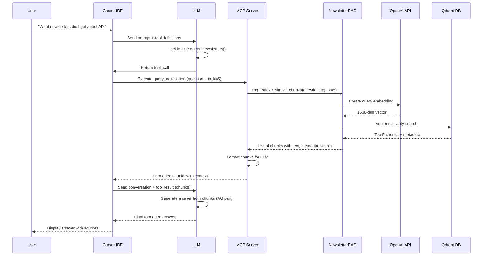

# Complete Flow: "What newsletters did I get about AI?"

## User Prompt
```
"What newsletters did I get about AI?"
```

---

## Part 1: Indexing Pipeline (One-Time Setup)

### Step 1: Convert .mbox to HTML

**Location:** `emails/mbox_to_html.py`

**What happens:**
- User runs: `python3 mbox_to_html.py path/to/your_emails.mbox`
- Script reads .mbox file (Google Takeout format)
- Extracts each email message
- Converts to individual HTML files with metadata header

**Output:**
- HTML files saved to `emails/emails_to_html/`
- Each file contains:
  - Subject, From, Date in header
  - Email body (HTML or text converted to HTML)

**Example HTML structure:**
```html
<div class="header">
  <div><span class="label">Subject:</span> Newsletter about AI</div>
  <div><span class="label">From:</span> newsletter@example.com</div>
  <div><span class="label">Date:</span> Fri, 31 May 2024...</div>
</div>
<div class="content">
  [Email body content]
</div>
```

---

### Step 2: Extract & Clean Email Data

**Location:** `src/preprocessor.py` → `EmailPreprocessor.extract_from_html()`

**What happens:**
- Reads HTML file
- Parses with BeautifulSoup
- Extracts metadata (subject, from, date)
- Extracts body text from `<div class="content">`
- Cleans text (normalizes whitespace, removes HTML entities)

**Code execution:**
```python
preprocessor = EmailPreprocessor()
email_data = preprocessor.extract_from_html("emails/emails_to_html/0001_Newsletter.html")

# Returns:
{
    "source": "emails/emails_to_html/0001_Newsletter.html",
    "subject": "Newsletter about AI",
    "from": "newsletter@example.com",
    "date": "Fri, 31 May 2024...",
    "body_text": "Cleaned email body text..."
}
```

---

### Step 3: Chunk Email Text

**Location:** `src/chunker.py` → `TokenChunker.chunk_email()`

**What happens:**
- Takes email body text
- Encodes to tokens using `tiktoken` (cl100k_base encoding)
- Splits into chunks of 300 tokens with 50-token overlap
- Creates chunk dictionaries with metadata

**Code execution:**
```python
chunker = TokenChunker(chunk_size=300, overlap=50)
chunks = chunker.chunk_email(email_data)

# Returns list of chunks:
[
    {
        "text": "First 300 tokens of email...",
        "source": "emails/emails_to_html/0001_Newsletter.html",
        "subject": "Newsletter about AI",
        "from": "newsletter@example.com",
        "date": "Fri, 31 May 2024...",
        "chunk_id": "emails/emails_to_html/0001_Newsletter.html_chunk_0",
        "chunk_index": 0,
        "token_count": 300
    },
    {
        "text": "Next chunk (with 50 token overlap)...",
        ...
        "chunk_index": 1,
        "token_count": 300
    }
]
```

**Why chunking:**
- Embedding models have token limits
- Smaller chunks = more precise retrieval
- Overlap preserves context across boundaries

---

### Step 4: Create Embeddings & Index in Qdrant

**Location:** `gmail-takeout-rag.ipynb` (or indexing script)

**What happens:**

#### 4a. Create Embeddings:
```python
from openai import OpenAI
openai_client = OpenAI(api_key=os.getenv("OPENAI_API_KEY"))

# For each chunk:
embedding = openai_client.embeddings.create(
    model="text-embedding-3-small",
    input=chunk["text"]
).data[0].embedding

# Returns: 1536-dimensional vector
```

#### 4b. Store in Qdrant:
```python
from qdrant_client.models import PointStruct

point = PointStruct(
    id=chunk_id,  # Unique ID
    vector=embedding,  # 1536-dim vector
    payload={
        "text": chunk["text"],
        "subject": chunk["subject"],
        "from": chunk["from"],
        "date": chunk["date"],
        "source": chunk["source"],
        "chunk_id": chunk["chunk_id"],
        "chunk_index": chunk["chunk_index"],
        "token_count": chunk["token_count"]
    }
)

qdrant_client.upsert(
    collection_name="newsletter_chunks",
    points=[point]
)
```

**Result:**
- All email chunks stored in Qdrant vector database
- Each chunk has:
  - Vector embedding (1536 dimensions)
  - Metadata (subject, from, date, source, etc.)
- Ready for semantic search!

---

## MCP Server Overview

**Location:** `mcp_server.py`

**What it is:**
The MCP (Model Context Protocol) server exposes the RAG system as tools that Cursor (and other MCP clients) can call. It acts as a bridge between Cursor's chat interface and the newsletter RAG system.

**Server Configuration:**
- **Server Name:** `newsletter-expert`
- **Protocol:** MCP over stdio (standard input/output)
- **Initialization:** On startup, initializes `NewsletterRAG` instance connected to Qdrant

**Available Tools:**

1. **`query_newsletters`**
   - **Purpose:** Search and query newsletter emails using natural language
   - **Parameters:**
     - `question` (required): The question to ask (e.g., "What newsletters did I get about AI?")
     - `top_k` (optional, default: 5): Number of relevant chunks to retrieve
   - **Returns:** Answer with sources (subject, from, date, relevance score, preview)
   - **Example:** `query_newsletters(question="What newsletters did I get about AI?", top_k=5)`

2. **`list_newsletter_stats`**
   - **Purpose:** Get statistics about the indexed newsletter collection
   - **Parameters:** None
   - **Returns:** Collection name, total chunks, vector dimensions, distance metric, status
   - **Example:** `list_newsletter_stats()`

**How it works:**
- On startup, initializes `NewsletterRAG` with Qdrant connection (localhost:6333, collection: `newsletter_chunks`)
- Exposes tools via `@server.list_tools()` decorator
- Handles tool calls via `@server.call_tool()` decorator
- Formats responses as `TextContent` for Cursor to display

**Cursor Configuration:**
```json
{
  "mcpServers": {
    "gmail-takeout-rag": {
      "command": "/path/to/.venv/bin/python3",
      "args": ["/path/to/mcp_server.py"],
      "env": {
        "OPENAI_API_KEY": "sk-..."
      }
    }
  }
}
```

---

## Part 2: Query Pipeline (Via MCP Server)

### Step 1: Cursor Receives Prompt

**Location:** Cursor IDE Chat Interface

**What happens:**
- User types: "What newsletters did I get about AI?"
- Cursor adds prompt to conversation history
- Cursor prepares to send to LLM (LLM)

**Conversation state:**
```json
{
  "messages": [
    {
      "role": "user",
      "content": "What newsletters did I get about AI?"
    }
  ]
}
```

---

### Step 2: Cursor Sends to LLM with Tool List

**Location:** Cursor → LLM API

**What happens:**
- Cursor loads MCP tool definitions from `gmail-takeout-rag` server
- Cursor sends to LLM:
  - User message
  - Tool definitions (query_newsletters, list_newsletter_stats)
  - Conversation history

**What LLM sees:**
```json
{
  "model": "claude-4.5-sonnet",
  "messages": [
    {
      "role": "user",
      "content": "What newsletters did I get about AI?"
    }
  ],
  "tools": [
    {
      "name": "query_newsletters",
      "description": "Search and query newsletter emails using natural language...",
      "inputSchema": {
        "type": "object",
        "properties": {
          "question": {"type": "string"},
          "top_k": {"type": "integer", "default": 5}
        },
        "required": ["question"]
      }
    },
    {
      "name": "list_newsletter_stats",
      ...
    }
  ]
}
```

---

### Step 3: LLM Decides Which Tool to Call

**Location:** LLM's reasoning (inside LLM)

**LLM's thinking process:**
```
User wants to know about newsletters related to AI.

Looking at available tools:
- query_newsletters(question, top_k) - searches newsletters using natural language
- list_newsletter_stats() - shows collection statistics

query_newsletters() is perfect for this! I'll call it with:
- question: "What newsletters did I get about AI?"
- top_k: 5 (default)
```

**LLM's response:**
```json
{
  "content": null,
  "tool_calls": [
    {
      "id": "call_123",
      "name": "query_newsletters",
      "arguments": {
        "question": "What newsletters did I get about AI?",
        "top_k": 5
      }
    }
  ]
}
```

**What you see in Cursor:**
```
LLM is thinking...
✓ Calling query_newsletters(question="What newsletters did I get about AI?", top_k=5)
```

---

### Step 4: Cursor Executes MCP Tool Call

**Location:** Cursor MCP Client

**What happens:**
- Cursor receives tool call request from LLM
- Cursor identifies this is from `gmail-takeout-rag` MCP server
- Cursor spawns/calls the MCP server process:
  ```bash
  /path/to/.venv/bin/python3 /path/to/mcp_server.py
  ```
- Cursor sends MCP protocol message:
  ```json
  {
    "jsonrpc": "2.0",
    "method": "tools/call",
    "params": {
      "name": "query_newsletters",
      "arguments": {
        "question": "What newsletters did I get about AI?",
        "top_k": 5
      }
    }
  }
  ```

---

### Step 5: MCP Server Receives Call

**Location:** `mcp_server.py`

**What happens:**
- MCP server receives the tool call via stdio
- Routes to `handle_call_tool()` function
- Extracts arguments: `question="What newsletters did I get about AI?"`, `top_k=5`
- Calls RAG system: `rag.query(question, top_k=5)`

**Code execution:**
```python
@server.call_tool()
async def handle_call_tool(name: str, arguments: dict) -> list:
    if name == "query_newsletters":
        question = arguments.get("question", "")
        top_k = arguments.get("top_k", 5)
        
        # Query the RAG system
        result = rag.query(question, top_k=top_k)
        # Returns: {"answer": "...", "sources": [...]}
```

---

### Step 6: RAG Retrieval - Embed Query

**Location:** `src/rag.py` → `NewsletterRAG.retrieve_similar_chunks()`

**What happens:**

#### 6a. Create Query Embedding:
```python
# Embed the user's question using same model as chunks
query_embedding = self.openai_client.embeddings.create(
    model="text-embedding-3-small",
    input="What newsletters did I get about AI?"
).data[0].embedding

# Returns: 1536-dimensional vector
```

**API Call:**
```
POST https://api.openai.com/v1/embeddings
{
  "model": "text-embedding-3-small",
  "input": "What newsletters did I get about AI?"
}
```

---

### Step 7: RAG Retrieval - Search Qdrant

**Location:** `src/rag.py` → `NewsletterRAG.retrieve_similar_chunks()`

**What happens:**
- Search Qdrant vector database using query embedding
- Find top-K most similar chunks (cosine similarity)
- Return chunks with metadata and similarity scores

**Code execution:**
```python
search_results = self.qdrant_client.query_points(
    collection_name="newsletter_chunks",
    query=query_embedding,  # 1536-dim vector
    limit=5  # top_k
).points

# Returns list of Point objects with:
# - score: similarity score (0.0 to 1.0)
# - payload: chunk metadata (text, subject, from, date, etc.)
```

**Qdrant Query:**
```
POST http://localhost:6333/collections/newsletter_chunks/points/query
{
  "vector": [0.123, -0.456, ...],  # 1536 dimensions
  "limit": 5,
  "with_payload": true
}
```

**Results:**
```python
[
    {
        "text": "AI newsletter content about machine learning...",
        "subject": "Weekly AI Newsletter - May 2024",
        "from": "ai-newsletter@example.com",
        "date": "Fri, 31 May 2024...",
        "score": 0.892,  # High similarity!
        "source": "emails/emails_to_html/0001_AI_Newsletter.html",
        "chunk_id": "...",
        "chunk_index": 0
    },
    # ... 4 more similar chunks
]
```

---

### Step 8: NewsletterRAG Returns Chunks

**Location:** `src/rag.py` → `NewsletterRAG.retrieve_similar_chunks()`

**What happens:**
- NewsletterRAG returns list of chunks (retrieval complete)
- No generation happens here - that's handled by the caller

**Code execution:**
```python
# NewsletterRAG returns chunks directly
chunks = rag.retrieve_similar_chunks(question, top_k=5)

# Returns list of chunk dictionaries:
[
    {
        "text": "AI newsletter content about machine learning...",
        "subject": "Weekly AI Newsletter - May 2024",
        "from": "ai-newsletter@example.com",
        "date": "Fri, 31 May 2024...",
        "score": 0.892,
        "source": "emails/emails_to_html/0001_AI_Newsletter.html",
        "chunk_id": "...",
        "chunk_index": 0
    },
    # ... 4 more chunks
]
```

**Key Point:** NewsletterRAG only does retrieval (R). Generation (AG) is handled by the caller.

---

### Step 9: MCP Server Formats Chunks for LLM

**Location:** `mcp_server.py` → `handle_call_tool()`

**What happens:**
- Receives chunks from NewsletterRAG
- Formats chunks with metadata for LLM to use
- Returns formatted context (no pre-generated answer)

**Code execution:**
```python
# Retrieve chunks (R part)
chunks = rag.retrieve_similar_chunks(question, top_k=top_k)

# Format chunks for LLM to generate answer (AG part)
context_parts = []
for i, chunk in enumerate(chunks, 1):
    context_parts.append(
        f"[Source {i}] {chunk['subject']} (from {chunk['from']}, {chunk['date']})\n"
        f"Relevance score: {chunk['score']:.3f}\n"
        f"{chunk['text']}\n"
    )

context = "\n---\n".join(context_parts)

response_text = f"**Retrieved {len(chunks)} relevant newsletter chunks:**\n\n"
response_text += context
response_text += f"\n\n**Question:** {question}\n\n"
response_text += "Please synthesize an answer from the above newsletter chunks."

return [types.TextContent(type="text", text=response_text)]
```

**MCP Response:**
```json
{
  "jsonrpc": "2.0",
  "result": [
    {
      "type": "text",
      "text": "**Retrieved 5 relevant newsletter chunks:**\n\n[Source 1] Weekly AI Newsletter...\n---\n[Source 2] AI Research Digest...\n\n**Question:** What newsletters did I get about AI?\n\nPlease synthesize an answer from the above newsletter chunks."
    }
  ]
}
```

---

### Step 10: LLM Generates Answer from Chunks

**Location:** LLM (second API call)

**What happens:**
- Cursor sends conversation (with tool result containing chunks) back to LLM
- LLM sees:
  - Original question: "What newsletters did I get about AI?"
  - Tool result: Formatted chunks with context

**LLM's thinking:**
```
The user asked about AI newsletters.

The tool returned 5 relevant chunks:
- Source 1: Weekly AI Newsletter (May 2024) - score 0.892
- Source 2: AI Research Digest - score 0.856
- Source 3: Tech News: AI Edition - score 0.823
...

I need to synthesize an answer from these chunks, summarizing what newsletters the user received about AI.
```

**LLM's response:**
```json
{
  "content": "Based on your newsletter collection, you received several newsletters about AI:\n\n**1. Weekly AI Newsletter (May 2024)**\n   - From: ai-newsletter@example.com\n   - Covered machine learning trends and recent developments\n   - Relevance score: 0.892\n\n**2. AI Research Digest**\n   - Featured papers on neural networks and deep learning\n\n**3. Tech News: AI Edition**\n   - Industry news and startup funding in AI space\n\nThese newsletters covered topics including machine learning, neural networks, and AI industry developments."
}
```

**MCP Response:**
```json
{
  "jsonrpc": "2.0",
  "result": [
    {
      "type": "text",
      "text": "**Answer:**\n\nBased on your newsletter collection, you received several newsletters about AI...\n\n**Sources (5 newsletters found):**\n\n1. **Weekly AI Newsletter - May 2024**\n   From: ai-newsletter@example.com\n   Date: Fri, 31 May 2024...\n   Relevance: 0.892\n   Preview: AI newsletter content about machine learning...\n\n..."
    }
  ]
}
```

---

### Step 11: Cursor Appends Tool Result to Conversation

**Location:** Cursor

**What happens:**
- Cursor receives MCP response (formatted chunks)
- Appends tool result to conversation history
- Sends back to LLM with tool result

**Conversation state:**
```json
{
  "messages": [
    {
      "role": "user",
      "content": "What newsletters did I get about AI?"
    },
    {
      "role": "assistant",
      "content": null,
      "tool_calls": [
        {
          "id": "call_123",
          "name": "query_newsletters",
          "arguments": {
            "question": "What newsletters did I get about AI?",
            "top_k": 5
          }
        }
      ]
    },
    {
      "role": "tool",
      "name": "query_newsletters",
      "content": "**Retrieved 5 relevant newsletter chunks:**\n\n[Source 1] Weekly AI Newsletter...\n---\n[Source 2] AI Research Digest...\n\n**Question:** What newsletters did I get about AI?\n\nPlease synthesize an answer from the above newsletter chunks."
    }
  ]
}
```

**Key Point:** Tool result contains chunks, not a pre-generated answer. LLM will generate the answer.

---

### Step 12: User Sees Final Response

**Location:** Cursor Chat Interface

**What user sees:**
```
Based on your newsletter collection, you received several newsletters about AI:

**1. Weekly AI Newsletter (May 2024)**
   - From: ai-newsletter@example.com
   - Covered machine learning trends and recent developments
   - Relevance score: 0.892

**2. AI Research Digest**
   - Featured papers on neural networks and deep learning

**3. Tech News: AI Edition**
   - Industry news and startup funding in AI space

These newsletters covered topics including machine learning, neural networks, and AI industry developments. You can see the full details and previews in the sources below.
```

---

## Complete Flow Diagram

```
┌─────────────────────────────────────────────────────────────┐
│ INDEXING PIPELINE (One-Time Setup)                         │
└─────────────────────────────────────────────────────────────┘

┌─────────────────────────────────────────────────────────────┐
│ GOOGLE TAKEOUT (.mbox files)                                │
│ your_emails.mbox                                            │
└─────────────────────────────────────────────────────────────┘
                        │
                        ▼
┌─────────────────────────────────────────────────────────────┐
│ mbox_to_html.py                                             │
│ - Reads .mbox file                                          │
│ - Extracts each email                                       │
│ - Converts to HTML with metadata header                     │
└─────────────────────────────────────────────────────────────┘
                        │
                        ▼
┌─────────────────────────────────────────────────────────────┐
│ HTML FILES (emails/emails_to_html/)                         │
│ 0001_Newsletter.html, 0002_Newsletter.html, ...            │
└─────────────────────────────────────────────────────────────┘
                        │
                        ▼
┌─────────────────────────────────────────────────────────────┐
│ EmailPreprocessor (preprocessor.py)                         │
│ - Parses HTML with BeautifulSoup                           │
│ - Extracts: subject, from, date, body_text                 │
│ - Cleans text (normalizes whitespace)                      │
└─────────────────────────────────────────────────────────────┘
                        │
                        ▼
┌─────────────────────────────────────────────────────────────┐
│ TokenChunker (chunker.py)                                   │
│ - Encodes text to tokens (tiktoken)                        │
│ - Splits into 300-token chunks with 50-token overlap       │
│ - Creates chunk dictionaries with metadata                  │
└─────────────────────────────────────────────────────────────┘
                        │
                        ▼
┌─────────────────────────────────────────────────────────────┐
│ OpenAI Embeddings API                                       │
│ - Creates 1536-dim vectors for each chunk                   │
│ - Model: text-embedding-3-small                             │
└─────────────────────────────────────────────────────────────┘
                        │
                        ▼
┌─────────────────────────────────────────────────────────────┐
│ QDRANT VECTOR DATABASE (Docker)                             │
│ Collection: newsletter_chunks                               │
│ - Stores vectors + metadata (subject, from, date, text)    │
│ - Ready for semantic search!                                │
└─────────────────────────────────────────────────────────────┘


┌─────────────────────────────────────────────────────────────┐
│ QUERY PIPELINE (Via MCP Server)                            │
└─────────────────────────────────────────────────────────────┘

┌─────────────────────────────────────────────────────────────┐
│ USER                                                        │
│ "What newsletters did I get about AI?"                     │
└─────────────────────────────────────────────────────────────┘
                        │
                        ▼
┌─────────────────────────────────────────────────────────────┐
│ CURSOR IDE                                                  │
│ - Receives prompt                                           │
│ - Adds to conversation history                              │
│ - Loads MCP tool definitions (query_newsletters, etc.)      │
└─────────────────────────────────────────────────────────────┘
                        │
                        ▼
┌─────────────────────────────────────────────────────────────┐
│ CURSOR → LLM                                         │
│ Sends:                                                      │
│ - User message                                              │
│ - Tool definitions                                          │
│ - Conversation history                                      │
└─────────────────────────────────────────────────────────────┘
                        │
                        ▼
┌─────────────────────────────────────────────────────────────┐
│ LLM                                                │
│ Reasoning:                                                  │
│ "User wants AI newsletters.                                │
│  query_newsletters() is perfect!"                          │
│                                                             │
│ Returns: tool_call for query_newsletters("...", top_k=5)   │
└─────────────────────────────────────────────────────────────┘
                        │
                        ▼
┌─────────────────────────────────────────────────────────────┐
│ CURSOR MCP CLIENT                                           │
│ Executes: query_newsletters(question="...", top_k=5)         │
│ Via: MCP protocol over stdio                               │
└─────────────────────────────────────────────────────────────┘
                        │
                        ▼
┌─────────────────────────────────────────────────────────────┐
│ MCP SERVER (mcp_server.py)                                  │
│ - Receives tool call                                        │
│ - Calls: rag.retrieve_similar_chunks(question, top_k=5)    │
└─────────────────────────────────────────────────────────────┘
                        │
                        ▼
┌─────────────────────────────────────────────────────────────┐
│ NewsletterRAG.retrieve_similar_chunks() (rag.py)           │
│ 1. Embeds query using OpenAI                                │
│    Model: text-embedding-3-small                            │
│    Returns: 1536-dim vector                                 │
└─────────────────────────────────────────────────────────────┘
                        │
                        ▼
┌─────────────────────────────────────────────────────────────┐
│ QDRANT VECTOR DATABASE                                      │
│ - Searches for top-5 most similar chunks                    │
│ - Uses cosine similarity                                    │
│ - Returns chunks with scores + metadata                     │
└─────────────────────────────────────────────────────────────┘
                        │
                        ▼
┌─────────────────────────────────────────────────────────────┐
│ NewsletterRAG                                               │
│ Returns: List of chunks (retrieval complete - R part)       │
└─────────────────────────────────────────────────────────────┘
                        │
                        ▼
┌─────────────────────────────────────────────────────────────┐
│ MCP SERVER                                                  │
│ Formats chunks with metadata for LLM                     │
│ Returns: TextContent with formatted chunks                  │
│ (No pre-generated answer - chunks only)                     │
└─────────────────────────────────────────────────────────────┘
                        │
                        ▼
┌─────────────────────────────────────────────────────────────┐
│ CURSOR                                                      │
│ Appends tool result (chunks) to conversation                 │
│ Sends back to LLM with tool result                      │
└─────────────────────────────────────────────────────────────┘
                        │
                        ▼
┌─────────────────────────────────────────────────────────────┐
│ LLM - Second Call                                  │
│ Sees:                                                       │
│ - Original question                                         │
│ - Tool result (formatted chunks)                            │
│                                                             │
│ Generates:                                                  │
│ - Synthesizes answer from chunks (AG part)                  │
│ - Formats response nicely                                   │
│                                                             │
│ Returns: Final formatted answer                            │
└─────────────────────────────────────────────────────────────┘
                        │
                        ▼
┌─────────────────────────────────────────────────────────────┐
│ USER                                                        │
│ Sees: Formatted answer with newsletter details              │
└─────────────────────────────────────────────────────────────┘
```

---

## Mermaid Flow Diagram


### Query Pipeline Flow (Sequence Diagram)



---

## Key Takeaways

1. **Two-Stage Pipeline:**
   - **Indexing** (one-time): .mbox → HTML → Extract → Chunk → Embed → Qdrant
   - **Querying** (on-demand): Question → Embed → Search → Format → Generate (by LLM)

2. **RAG Architecture (Separation of Concerns):**
   - **Retrieval (R)**: NewsletterRAG handles embedding queries and searching Qdrant
   - **Augmentation**: Context from retrieved chunks formatted by MCP server
   - **Generation (AG)**: LLM (or caller's LLM) creates answer from context + question
   - **Benefit**: NewsletterRAG focuses on retrieval; generation handled by caller

3. **Vector Search:**
   - Query and chunks use same embedding model (`text-embedding-3-small`)
   - Cosine similarity finds semantically similar content
   - Top-K retrieval ensures relevant context for generation

4. **MCP Integration:**
   - Cursor orchestrates tool calls
   - MCP server exposes retrieval as tools
   - NewsletterRAG does retrieval only (R part)
   - LLM handles generation (AG part) - no double processing!

5. **Components:**
   - **Preprocessor**: Extracts and cleans email data
   - **Chunker**: Splits text into searchable chunks
   - **NewsletterRAG**: Retrieves relevant chunks (R only)
   - **MCP Server**: Formats chunks for LLM
   - **LLM**: Generates answer from chunks (AG)

---

## What Gets Logged

**MCP Server logs (stderr):**
```
Newsletter RAG initialized
✅ Connected to Qdrant collection 'newsletter_chunks'
   Vectors: 193
```

**OpenAI API calls:**
- Embedding creation (for query) - only for retrieval
- No chat completion in NewsletterRAG (generation handled by LLM)

**Qdrant queries:**
- Vector similarity search logs (if enabled)

**Cursor MCP logs (visible in Cursor):**
- Tool call requests
- Tool responses
- MCP server errors

---

This is the complete flow! 🎯
